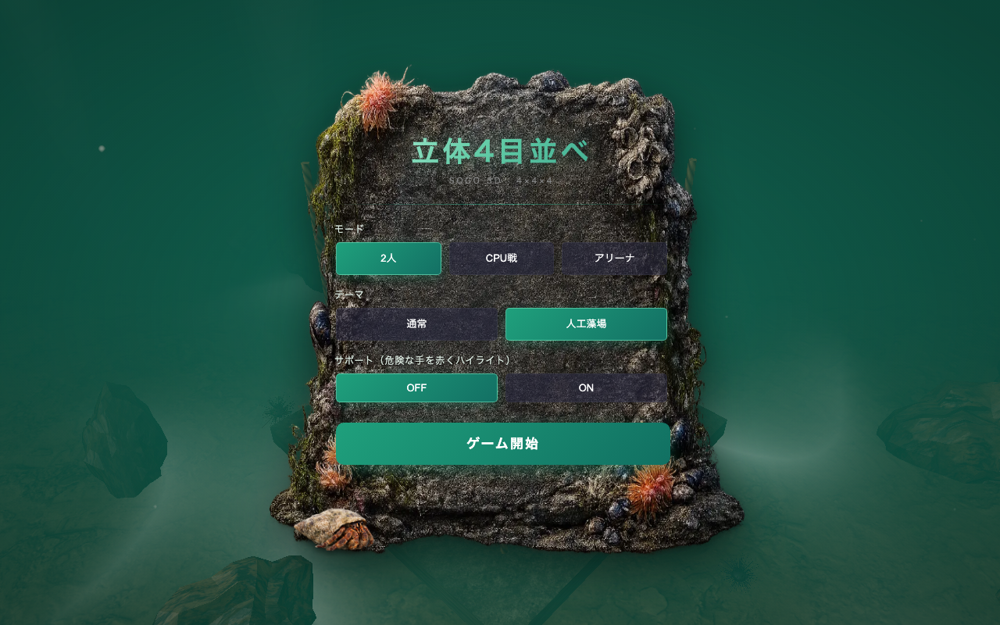
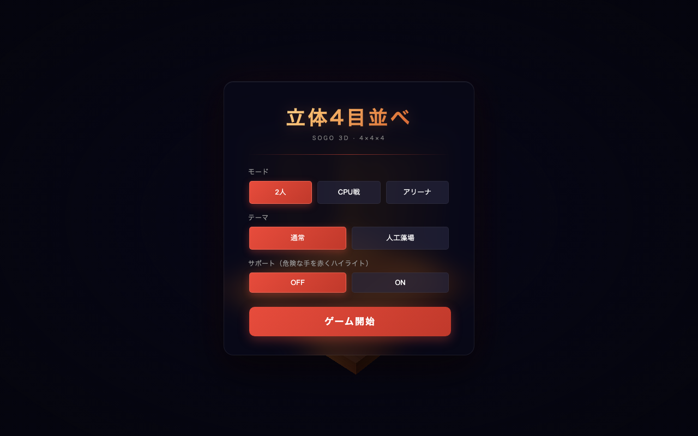
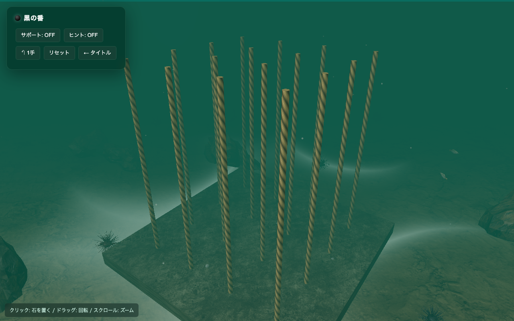
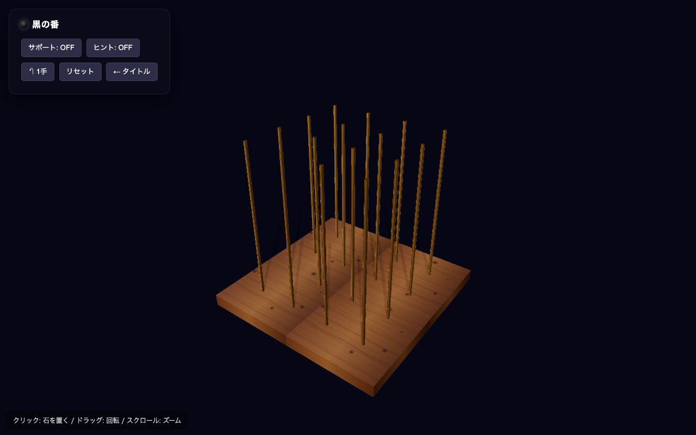

<div align="center">

# 立体4目並べ — Sogo 3D · 4×4×4

**A photoreal 3D Connect Four (4 × 4 × 4) playable in a single self-contained HTML file.**
**1ファイルで動くフォトリアル 3D 立体4目並べ（4×4×4 ソゴ）。**



[Setup](#-setup--セットアップ) · [Play](#-how-to-play--遊び方) · [Themes](#-themes--テーマ) · [Tech](#-technical-highlights--技術ハイライト) · [Credits](#-credits--クレジット)

[](https://threejs.org/)
[](LICENSE)
[](#-setup--セットアップ)

</div>

---

## 🎯 Overview / 概要

> **EN** — Two players (or vs. CPU / CPU-vs-CPU arena mode) take turns dropping stones onto a 4 × 4 grid of vertical posts. Stones stack on each post; the first player to align four of their colour along any 3D line — row, column, vertical post, or diagonal across the cube — wins. The game ships with two visual themes: a clean **wooden board** for focused play, and an **underwater artificial-reef** (人工藻場) theme rendered with real-photo creatures, animated kelp, drifting marine snow, a patrolling UUV, and aging concrete encrustation on each cage.

> **JA** — 2 人対戦／CPU 戦／CPU 同士のアリーナ戦で、4 × 4 マスの上に立つ柱に石を落として 4 つ揃えるゲームです。同じ柱の上に積み上がり、最初に縦・横・柱方向・3D 対角線のいずれかで自分の色を 4 つ並べたプレイヤーが勝ち。**通常テーマ**（木の盤＋真鍮の柱）と、**人工藻場テーマ**（写真ベースの魚・揺れるカジメ・浮遊する有機物、定期的に巡回する水中ドローン UUV、時間とともに藻むしていくコンクリート骨材）の 2 種類のビジュアルが用意されています。

## ✨ Features / 特徴

| | EN | JA |
|---|---|---|
| 🧊 | True 3D 4 × 4 × 4 board with 76 winning lines | 76 本の勝ち筋がある 3D 立体盤 |
| 👤 | Local 2P, CPU (Lv1 – Lv3 minimax with α–β), CPU arena | 2 人ローカル、CPU（Lv1〜3 αβ ミニマックス）、CPU 同士のアリーナ |
| 🐟 | 5 photoreal fish species with boids flocking | 5 種の写真ベースの魚＋ boids 群行動 |
| 🦑 | 3D squid with carangiform fin wave | 立体的なヒレ波動つきイカ |
| 🌊 | Underwater volumetric god rays + projected caustics | 海上から差し込むゴッドレイ＋海底のコースティック |
| 🦞 | Walking, clickable hermit crab on the title panel | クリックで貝に引っ込む、歩くヤドカリ |
| 🛟 | UUV drone patrol with directional spotlight + thruster bubbles | スポットライトと泡を残すパトロール UUV ドローン |
| 🌿 | Cage rubble ages from clean concrete → algae-encrusted over 75 s | カゴ内のコンクリ骨材が 75 秒で藻むしていく |
| 🔊 | Theme-aware SFX: dry wooden thock vs. submerged metallic clang | 通常 = 木の thock、藻場 = 水中の重い金属音 |
| 🎚 | Camera clamped above seabed; no view-through-floor | カメラが海底より下に沈まない制約 |
| ♿ | Hint mode + dangerous-move warnings | 危険手警告と最善手ヒント |
| 💾 | LocalStorage stats + theme/audio preferences | 戦績とテーマ・音量設定の永続化 |
| 🎯 | Zero build step — open in any modern browser | ビルド不要、開けば動く |

## 📸 Screenshots / スクリーンショット

| Title — 人工藻場 | Title — 通常 |
|---|---|
|  |  |
| Photo-rim 磯-rock panel with a clickable hermit crab walking the rim. <br/> 磯の岩肌パネル＋ふちを歩くクリック反応するヤドカリ。 | Clean glassy card on a vignetted black backdrop. <br/> 暗い背景に浮かぶ透明感のあるカード。 |

| Gameplay — 人工藻場 | Gameplay — 通常 |
|---|---|
|  |  |
| Concrete board with rope-twined posts at 20 m depth. <br/> 水深 20 m の海底にロープが巻かれた柱。 | Wood board with brass posts under a key light. <br/> 木の盤と真鍮の柱、上方のキー光。 |

## 🚀 Setup / セットアップ

> The page uses ES-module imports and `fetch()`, so it must be served over HTTP — opening with `file://` will not work.
> ES モジュールと `fetch()` を使うため、`file://` ではなく **HTTP サーバ経由で開く必要があります**。

```sh
# from this folder / このフォルダで:
python3 -m http.server 8000
```

then open **<http://127.0.0.1:8000/sogo3d.html>** in any modern browser.

Three.js 0.160 is loaded from the [unpkg](https://unpkg.com) CDN via `<script type="importmap">` — **no install step**.

**Live demo via GitHub Pages**: enable in the repo *Settings → Pages*, set source to `main` branch, and visit `https://moriken2004.github.io/SOGO_3D-Moba/sogo3d.html`.

**GitHub Pages**: リポジトリ設定 → Pages で `main` ブランチを公開すれば、`https://moriken2004.github.io/SOGO_3D-Moba/sogo3d.html` で誰でも遊べます。

## 🎮 How to play / 遊び方

| | Controls / 操作 |
|---|---|
| 🖱 **Click / クリック** | Drop a stone onto the highlighted post / ハイライトされた柱に石を投下 |
| 🖱 **Drag / ドラッグ** | Orbit the camera around the board / 盤面の周囲をカメラが旋回 |
| 🖲 **Scroll / スクロール** | Zoom in / out / ズームイン・アウト |
| ⤴ **「↶ 1手」** | Undo one move (two in CPU mode so it's still your turn) / 一手戻る（CPU 戦は 2 手分） |

**Rules / ルール**

- The board has 4 × 4 = 16 posts. Stones drop and stack vertically on the chosen post (gravity).
- 盤面は 4×4=16 本の柱。石を落とすと選んだ柱に重力で積み上がる。
- Make four of your colour in a line — straight (row / column / post) or diagonal in any plane or through the cube — to win.
- 自分の色を一直線（縦・横・柱方向）または立方体内の任意の対角線で 4 つ揃えれば勝利。
- There are **76 distinct winning lines** in 4 × 4 × 4 sogo.
- 4×4×4 立体4目並べには合計 **76 本** の勝ち筋がある。

**Support modes / 補助機能**

- **サポート (Support)** — Cells where a move would let the opponent win get a soft-red glow.
- 自分が打つと相手が勝ってしまう柱を赤くハイライト。
- **ヒント (Hint)** — Highlights the engine's recommended next move (minimax up to Lv3).
- ミニマックスエンジン（Lv3 まで対応）が推す最善手を青で表示。

## 🌊 Themes / テーマ

### 通常 — Wood + Brass

A focused, distraction-free interface. Polished marble stones drop onto a wooden board with brass posts; landing produces a dry wooden thock with inharmonic-partial body resonance.

集中して指したい人向けの素直なインターフェース。木の盤と真鍮の柱、ピカピカの大理石石。着底音は乾いた木の「コツン」（非調和倍音付き）。

### 人工藻場 — Artificial-Reef Cages, Underwater

A rendition of an actual fisheries-restoration technique: concrete-rubble-filled wire cages stacked on the seabed to seed *Ecklonia cava* (カジメ) kelp forests. The board is rendered as the topmost concrete pad of such a structure at ~20 m depth, with the full ecosystem populating around it as you play.

実際の漁場造成手法を再現。コンクリート骨材を入れたワイヤーケージを海底に積み、カジメ（*Ecklonia cava*）藻場を造る人工漁礁。プレイ中は水深約 20 m の海底に置かれたコンクリート盤面のまわりに生態系が育っていきます。

What you'll see / 出てくる生き物：

- **5 species of fish** — メバル (Sebastes inermis 20–30 cm), アジ (Trachurus japonicus 25–35 cm), クロダイ (Acanthopagrus schlegelii 30–45 cm), タカベ (Labracoglossa argentiventris 18–26 cm), イトヨリダイ (Nemipterus virgatus 22–32 cm). **Realistic body lengths** scaled to the 1 m UUV. Same-species fish flock via classical boids (separation + alignment + cohesion).
- **イカ** (Squid) — Photoreal mantle + arms + carangiform fin wave. Spawn rate scales with reef size.
- **UUV drone** — 1 m orange autonomous vehicle on patrol. Underwater-muffled thruster sound proportional to camera distance.
- **ウニ / 岩 / カジメ** — Sea urchins, photo-textured boulders, kelp clumps that grow around each placed cage.
- **Marine snow + bubbles + god rays + animated caustics** — atmosphere.
- **Time-aging cage rubble** — concrete colour drifts from `#b7b0a4` (fresh) → `#636a48` (algae) over 75 s, with per-cage randomised speed.

## 🛠 Technical highlights / 技術ハイライト

| EN | JA |
|---|---|
| **Procedural fish bodies** via `LatheGeometry` with planar UV projection. The body's V range is compressed to the central 58 % of the photo to keep the silhouette opaque from any viewing angle. | `LatheGeometry`（回転体）と平面投影 UV で写真テクスチャを 3D 魚体に貼付け。V を中央 58% に圧縮して角度を変えても透ける部分なし。 |
| **Tail-only undulation** — carangiform per-vertex wave with `tailBias⁴` so only the rear of the body wags, head stays rigid. | 尾部のみが振動する carangiform 波動（`tailBias⁴`）で頭は剛体・尾だけ揺れる。 |
| **Boids flocking** — O(N²) but capped at 30 fish. Per-species separation / alignment / cohesion + reef-orbit ring attractor + cage-avoidance + hard outer boundary. | 30 体上限の O(N²) boids。同種で integ＋分離＋整列＋凝集、リングへの引力、カゴ周辺の斥力、強制境界。 |
| **Volumetric god rays** — additive-blended shader on 9 billboarded vertical wedges, fade out before reaching the seabed so the floor stays murky. | 加算合成のシェーダで縦楔形を 9 本配置。海底に届く前にフェードアウトして暗さを保持。 |
| **Animated caustics** — wavefront-interference shader on a plane just above the sand. Coverage restricted to ~7 m disc around the play area. | 波面干渉のシェーダで砂のすぐ上を揺らめく。プレイエリア半径 7 m に限定。 |
| **Underwater-muffled SFX** — 2-stage cascade LPFs + slow LFO + distance attenuation `1 / (1 + (d/5)²)` driven by the camera-to-UUV distance. | 2 段ローパス + ゆっくりした LFO + カメラ距離 `1/(1+(d/5)²)` の音量減衰。 |
| **WebGL memory hygiene** — explicit `dispose()` of per-instance cloned geometries / materials in `clearReefEffects`, `reskinStones`, `restartGame`, `undo`, `highlightLastMove`, and `updateUUV` to prevent GPU buffer leaks across long sessions. | 長時間プレイでも GPU バッファがリークしないよう、`dispose()` を全クリーンアップ経路で明示。 |
| **Stone reskin on theme switch** — existing stones are recreated with the new theme's mesh at the same grid position; the highlighted last-move ring carries over. | テーマを切り替えると既に置かれた石も新テーマのメッシュに変換されて再配置。 |
| **Win-line drawn on landing** — the red 4-in-a-row line is suppressed during the falling animation and drawn exactly when the winning stone settles. | 勝ち筋の赤線は石が着底した瞬間に初めて描画され、空中に浮かない。 |

## 📁 Folder layout / ファイル構成

```
SOGO_3D-Moba/
├── sogo3d.html                    the entire game (≈ 3 000 lines, vanilla JS + Three.js)
├── README.md
├── LICENSE                        MIT
└── assets/
    ├── UUV.stl                    patrol drone mesh (~ 12 MB)
    ├── concrete_*.jpg             PBR maps for cage rubble / board base (Poly Haven, CC0)
    ├── rock_06_*.jpg              PBR maps for seabed rocks (Poly Haven, CC0)
    ├── sand_*.jpg                 PBR maps for the seabed sand (Poly Haven, CC0)
    ├── iso_panel.png              磯-rock backdrop for the seaweed title screen
    ├── crab_full.png              hermit crab photo cut-out (out)
    ├── crab_tuck.png              hermit crab photo cut-out (withdrawn)
    ├── fish/fish_1..5.png         5 lateral fish photo cut-outs
    └── screenshots/               README screenshots (auto-captured via Playwright)
```

Every asset path in `sogo3d.html` is relative (`assets/…`), so renaming the parent folder is safe as long as `assets/` stays next to `sogo3d.html`.

`sogo3d.html` 内のアセットパスは全て相対パス。`assets/` を `sogo3d.html` の隣に置いておけば、フォルダ名変更も自由です。

## 🙏 Credits / クレジット

- **3D engine** — [Three.js 0.160.0](https://threejs.org/) (MIT)
- **Concrete / rock / sand PBR maps** — [Poly Haven](https://polyhaven.com/) (CC0)
- **Hermit crab photo** — user-supplied; processed locally with [rembg](https://github.com/danielgatis/rembg) + ISNet-General-Use matting
- **Fish photos** — user-supplied; processed via OpenCV + PIL
- **UUV STL** — user-supplied 1 m autonomous-vehicle mesh

## 📜 License / ライセンス

Code: **MIT** — see [LICENSE](LICENSE).
External assets retain their original licences as listed above (Poly Haven maps are CC0; user-supplied photos belong to their photographer).

コード：**MIT**。外部アセットは上記の各オリジナルライセンスに従います（Poly Haven は CC0、ユーザー提供写真は撮影者に帰属）。
